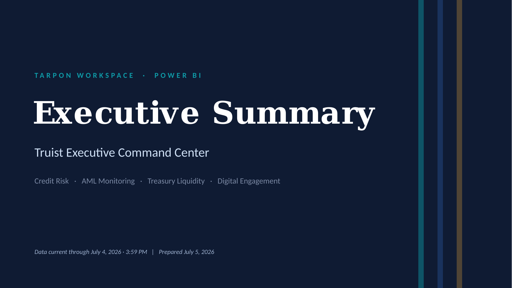
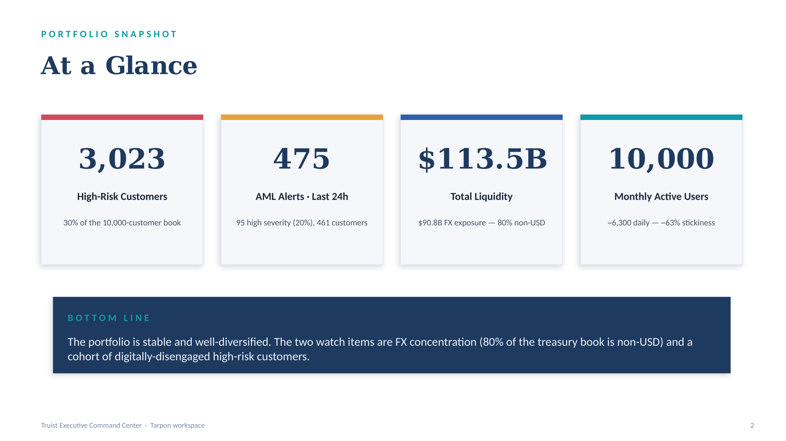
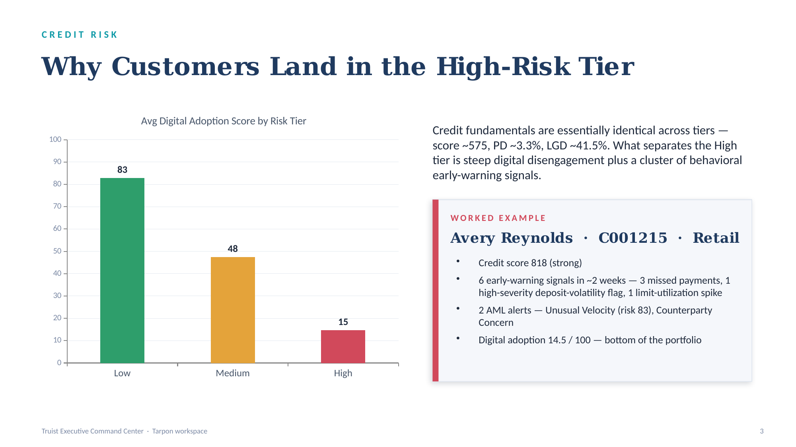
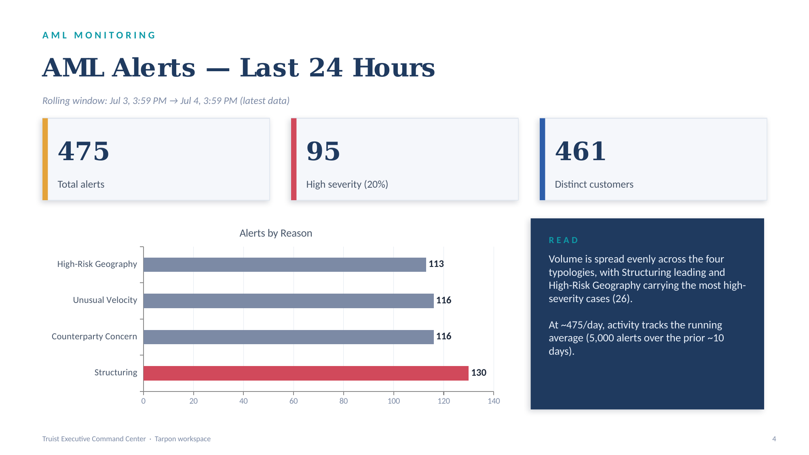
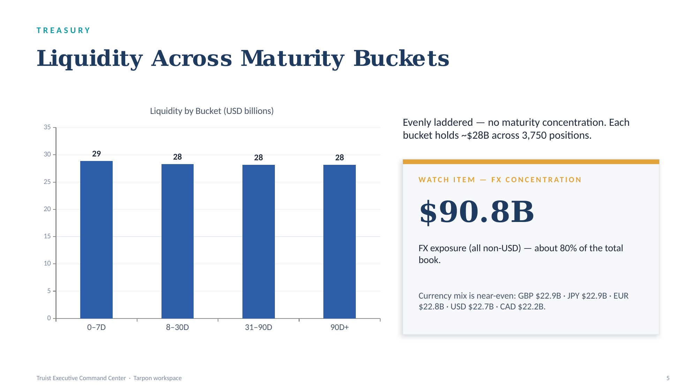
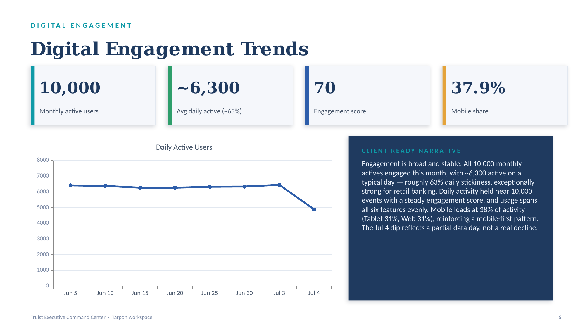
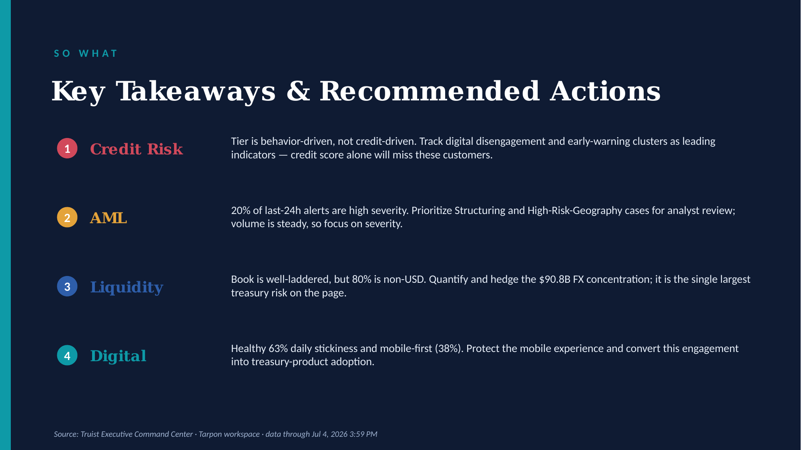

# Executive Summary — Truist Executive Command Center

**Source:** Truist Executive Command Center · Tarpon workspace (Power BI)
**Data current through:** July 4, 2026 · 3:59 PM  |  **Prepared:** July 5, 2026
**Deck:** Executive summary package (this folder) · 7 slides · ~20–25 min presenting time

> This document reproduces each slide as an image, followed by its on-slide text and the presenter notes (2–5 minutes of talking points per slide).

---

## Slide 1 — Executive Summary (Title)

**On-slide text**

- *Eyebrow:* TARPON WORKSPACE · POWER BI
- **Executive Summary**
- Truist Executive Command Center
- Credit Risk · AML Monitoring · Treasury Liquidity · Digital Engagement
- *Footer:* Data current through July 4, 2026 · 3:59 PM  |  Prepared July 5, 2026

**Presenter notes** *(~2 min)*

Good morning, everyone. What you're looking at is the Executive Summary from our Truist Executive Command Center, published in the Tarpon workspace and refreshed through the close of business on July 4th. The value of this single view is that it pulls four very different disciplines onto one page — credit risk, anti-money-laundering monitoring, treasury liquidity, and digital engagement — so leadership can read financial and operational health at a glance instead of chasing four separate reports.

Here's how I'll structure the next few minutes. First, the at-a-glance numbers — the four headline metrics that frame everything else. Then I'll take each domain in turn: what is actually driving customers into our high-risk tier, the last 24 hours of AML alerts, how our liquidity is laddered across maturities, and the digital engagement story. I'll close with four concrete, owner-ready actions.

Two themes to listen for. First, this book is fundamentally stable and well-diversified — there is no fire to put out today. Second, stable is not the same as risk-free: there are exactly two watch items — an FX concentration in the treasury book, and a pocket of digitally-disengaged high-risk customers — that deserve deliberate attention before they become problems. One caveat on the data: every figure is a point-in-time read as of July 4th at 3:59 PM, so when I say "last 24 hours" I mean the 24 hours ending at that refresh, not this morning. Let's dig in.

---

## Slide 2 — At a Glance

**On-slide text**

| Metric | Value | Detail |
|---|---|---|
| High-Risk Customers | **3,023** | 30% of the 10,000-customer book |
| AML Alerts · Last 24h | **475** | 95 high severity (20%), 461 customers |
| Total Liquidity | **$113.5B** | $90.8B FX exposure — 80% non-USD |
| Monthly Active Users | **10,000** | ~6,300 daily — ~63% stickiness |

> **Bottom line:** The portfolio is stable and well-diversified. The two watch items are FX concentration (80% of the treasury book is non-USD) and a cohort of digitally-disengaged high-risk customers.

**Presenter notes** *(~3 min)*

Start with scale. We have a 10,000-customer retail book. Card one: 3,023 of them — roughly 30% — sit in our High-risk tier. That is a meaningful share, and on the next slide I'll show you the surprising reason they're there, because it is NOT what most people assume.

Card two, AML: in the most recent 24-hour window we generated 475 alerts touching 461 distinct customers, and 95 of those — one in five — were high severity, meaning a risk score of 80 or above. That 20% high-severity rate is the number to anchor on; raw alert volume matters less than how many are genuinely serious.

Card three, liquidity: the commercial treasury book totals about $113.5 billion. The figure I want to flag early is the $90.8 billion of FX exposure — roughly 80% of the book is held in non-USD currencies. We'll come back to that as our single largest treasury risk.

Card four, digital: all 10,000 customers were active at least once this month, and on a typical day about 6,300 are active — a daily-to-monthly stickiness of around 63%, which is genuinely strong for retail banking.

Now the bottom line, and I'd read this almost verbatim: the portfolio is stable and well-diversified — there's no acute problem. But two things warrant deliberate management attention: the FX concentration in treasury, and the cohort of digitally-disengaged customers who are landing in our high-risk tier. Everything else on the following slides supports or unpacks these two points. Pause here for any early questions before we go deep.

---

## Slide 3 — Why Customers Land in the High-Risk Tier

**On-slide text**

*Chart — Avg Digital Adoption Score by Risk Tier:* Low **82.9** · Medium **47.5** · High **14.7**

Credit fundamentals are essentially identical across tiers — score ~575, PD ~3.3%, LGD ~41.5%. What separates the High tier is steep digital disengagement plus a cluster of behavioral early-warning signals.

**Worked example — Avery Reynolds · C001215 · Retail**

- Credit score 818 (strong)
- 6 early-warning signals in ~2 weeks — 3 missed payments, 1 high-severity deposit-volatility flag, 1 limit-utilization spike
- 2 AML alerts — Unusual Velocity (risk 83), Counterparty Concern
- Digital adoption 14.5 / 100 — bottom of the portfolio

**Presenter notes** *(~4–5 min)*

Set up the puzzle first. Intuitively, you'd expect our high-risk customers to have weak credit — low scores, high probability of default, high loss-given-default. When I pulled the numbers, that expectation was wrong, and that's the headline. Across all three tiers — Low, Medium, and High — the credit fundamentals are essentially identical: average credit score sits around 575, probability of default around 3.3%, and loss-given-default around 41.5% in every tier. Credit metrics do not distinguish our risk tiers at all.

So what does? The chart on the left answers it. The one variable that moves sharply across tiers is Digital Adoption Score: it averages about 83 for Low-risk customers, drops to roughly 47 for Medium, and collapses to about 15 for High. In other words, disengagement from our digital channels is the strongest correlate of the high-risk classification in this model — alongside a cluster of behavioral early-warning signals.

Make this concrete with the example on the right — Avery Reynolds, customer C001215, a retail client. Here's the paradox in one person: an 818 credit score, which is excellent. On credit alone this customer looks pristine. But look at the behavior. In roughly two weeks they tripped six early-warning signals — three missed payments, a high-severity deposit-volatility flag, and a limit-utilization spike — and generated two AML alerts, one of them an Unusual Velocity alert scoring 83. And their digital adoption score is 14.5, near the very bottom of the book. So a customer who looks flawless on a credit report is, behaviorally, flashing red.

The "so what" — and I'll preview the recommendation: if we manage high-risk purely off credit scores, we will systematically miss customers like Avery. The leading indicators here are behavioral — missed payments, deposit volatility, and digital disengagement. That's a monitoring and outreach opportunity, not a lending decision. One honesty caveat if anyone asks: the model holds a customer's current tier, not a dated history, so I'm explaining the drivers of the classification rather than a specific moment they "moved" — but the drivers are clear and consistent.

---

## Slide 4 — AML Alerts, Last 24 Hours

**On-slide text**

*Rolling window: Jul 3, 3:59 PM → Jul 4, 3:59 PM (latest data)*

- **475** — Total alerts
- **95** — High severity (20%)
- **461** — Distinct customers

*Chart — Alerts by Reason:* Structuring **130** · Counterparty Concern **116** · Unusual Velocity **116** · High-Risk Geography **113**

> **Read:** Volume is spread evenly across the four typologies, with Structuring leading and High-Risk Geography carrying the most high-severity cases (26). At ~475/day, activity tracks the running average (5,000 alerts over the prior ~10 days).

**Presenter notes** *(~3–4 min)*

First, define the window precisely, because it matters. This is the 24-hour period ending at our July 4th, 3:59 PM refresh — so Jul 3 at 3:59 PM through Jul 4 at 3:59 PM. It is not literally the last day from this morning; it's the last day of available data. I call that out so no one over-reacts to it as breaking news.

The three cards: 475 total alerts, spread across 461 distinct customers — so this is broad, one-alert-per-customer activity, not a handful of customers generating dozens of alerts. Of those 475, 95 are high severity, a risk score of 80 or higher. That 20% high-severity rate is the number I'd manage to. Volume by itself is noise; severity is signal.

Now the reasons, on the bar chart. The four typologies are remarkably even: Structuring leads at 130 alerts, followed by Counterparty Concern and Unusual Velocity tied at 116 each, and High-Risk Geography at 113. No single typology is running away. Two nuances worth mentioning: Structuring both leads on volume and carries 28 of the high-severity cases, and High-Risk Geography, while lowest on volume, actually carries the most high-severity cases at 26 — so on a severity-weighted basis, geography punches above its volume.

For context on whether 475 is high: the model holds 5,000 alerts over the prior ten days or so, which is about 500 a day. So 475 is right on trend — a normal day, not a spike. The read on the right captures it: even distribution, Structuring leads, and analyst attention should follow severity — prioritize the Structuring and High-Risk-Geography cases for review. If anyone asks about false-positive rates or tuning, that's a fair follow-up but it's outside what this page shows; I can pull the disposition data separately.

---

## Slide 5 — Liquidity Across Maturity Buckets

**On-slide text**

*Chart — Liquidity by Bucket (USD billions):* 0–7D **28.9** · 8–30D **28.3** · 31–90D **28.2** · 90D+ **28.2**

Evenly laddered — no maturity concentration. Each bucket holds ~$28B across 3,750 positions.

**Watch item — FX concentration**

- **$90.8B** FX exposure (all non-USD) — about 80% of the total book.
- Non-USD mix is near-even: GBP $22.9B · JPY $22.9B · EUR $22.8B · CAD $22.2B.

**Presenter notes** *(~3–4 min)*

Start with the reassuring part — the chart on the left. Our $113.5 billion commercial treasury book is laddered almost perfectly evenly across maturity buckets: roughly $28.9 billion maturing in 0 to 7 days, $28.3 billion in 8 to 30 days, and about $28.2 billion each in the 31-to-90-day and 90-day-plus buckets. Each bucket also holds the same 3,750 positions. From a liquidity-management standpoint that even ladder is exactly what you want — there's no maturity wall, no lumpy concentration where a large tranche all comes due at once. Short-term obligations are comfortably covered.

Now turn to the watch item on the right, and this is the one number I want to leave you with from this slide: $90.8 billion of FX exposure. That is the sum of every non-USD position, and it's about 80% of the book. Only roughly a fifth of our treasury liquidity is actually in dollars. The non-USD mix underneath is near-even — GBP, JPY, EUR, and CAD each sit in the $22 to $23 billion range — so we're not concentrated in one foreign currency, but we ARE overwhelmingly exposed to foreign-exchange movement in aggregate.

Why it matters: maturity risk here is well-managed, but currency risk is not visibly hedged on this page. An 80% non-USD book means our liquidity value moves materially with FX rates. My recommendation, which I'll repeat on the closing slide, is that treasury quantify the net-of-hedges FX exposure and confirm it sits within risk appetite. To be transparent about the data: treasury positions here carry no time dimension, so this is the current distribution across buckets — a point-in-time snapshot — not a period-over-period change. If leadership wants a trend line on FX exposure over time, that would need a different data source.

---

## Slide 6 — Digital Engagement Trends

**On-slide text**

- **10,000** — Monthly active users
- **~6,300** — Avg daily active (~63%)
- **70** — Engagement score
- **37.9%** — Mobile share

*Chart — Daily Active Users:* steady in the mid-6,000s (Jun 5 → Jul 3), dipping to 4,876 on Jul 4.

> **Client-ready narrative:** Engagement is broad and stable. All 10,000 monthly actives engaged this month, with ~6,300 active on a typical day — roughly 63% daily stickiness, exceptionally strong for retail banking. Daily activity held near 10,000 events with a steady engagement score, and usage spans all six features evenly. Mobile leads at 38% of activity (Tablet 31%, Web 31%), reinforcing a mobile-first pattern. The Jul 4 dip reflects a partial data day, not a real decline.

**Presenter notes** *(~3–4 min)*

Open with the stickiness story, because it's the strongest metric on the page. Across the trailing month all 10,000 of our customers were active at least once — full monthly reach. More impressively, on a typical day about 6,300 are active. That daily-active-to-monthly-active ratio is roughly 63%, and for retail banking that is excellent — it means nearly two-thirds of our base touches us every single day, not just when a bill is due. Digital is a genuine daily habit for these customers.

Point to the line chart. Daily active users are remarkably flat in the mid-6,000s all month — there's no erosion, no worrying downtrend, and the engagement score holds steady around a 70 on our weighted index. One thing to pre-empt: you'll see a drop at the far right, July 4th, down to about 4,876. That is NOT a real decline — July 4th is a partial data day, cut off at the 3:59 PM refresh, so it simply has fewer hours in it. Don't let anyone read that dip as a churn signal.

Then breadth of usage. Activity is spread evenly across all six features we track — Login, Bill Pay, Transfers, Card Controls, Profile updates, and Treasury Approvals each draw about the same volume. That even spread tells us customers rely on the platform for both everyday tasks and higher-value actions, not just one narrow use case. And on device: Mobile leads at about 38% of activity, with Tablet and Web each near 31%. We are a mobile-first franchise.

The right-hand panel is written as a client-ready narrative — if you're presenting this to the client directly, you can essentially read it aloud. The strategic takeaway I'll carry to the close: this engagement is an asset. The opportunity is to convert that daily digital habit — especially on mobile — into deeper product adoption, particularly treasury and card products, rather than letting it stay transactional.

---

## Slide 7 — Key Takeaways & Recommended Actions

**On-slide text**

1. **Credit Risk** — Tier is behavior-driven, not credit-driven. Track digital disengagement and early-warning clusters as leading indicators — credit score alone will miss these customers.
2. **AML** — 20% of last-24h alerts are high severity. Prioritize Structuring and High-Risk-Geography cases for analyst review; volume is steady, so focus on severity.
3. **Liquidity** — Book is well-laddered, but 80% is non-USD. Quantify and hedge the $90.8B FX concentration; it is the single largest treasury risk on the page.
4. **Digital** — Healthy 63% daily stickiness and mobile-first (38%). Protect the mobile experience and convert this engagement into treasury-product adoption.

**Presenter notes** *(~2–3 min)*

Let me land this on four actions, one per domain, each with a natural owner.

One, Credit Risk. The key insight was that our tier is behavior-driven, not credit-driven — a customer with an 818 score can still be high-risk. The action: stop relying on credit score alone to flag high-risk customers. Add digital disengagement and early-warning clusters — missed payments, deposit volatility — as leading indicators, and route those customers to proactive outreach. Owner: risk analytics, partnering with retail.

Two, AML. One in five of the last 24 hours' alerts were high severity, and Structuring and High-Risk Geography carry the most serious cases. The action is prioritization, not more volume: focus analyst capacity on severity-weighted queues. Owner: financial crimes.

Three, Liquidity. This is the one I most want a decision on. The book is well-laddered on maturity, but 80% of it — $90.8 billion — is non-USD. The action: treasury quantifies net FX exposure after hedges and confirms it's within appetite, and comes back with a hedging recommendation if it isn't. Owner: treasury.

Four, Digital. We have a healthy 63% daily stickiness and a mobile-first base. The action is offensive rather than defensive: protect the mobile experience and build a plan to convert that daily engagement into treasury and card product adoption. Owner: digital and product.

To close: the portfolio is healthy — no fires — but I'd like two commitments before we leave the room: a treasury read on the FX concentration, and agreement to pilot behavior-based flags for the high-risk cohort. Everything on these slides is sourced from the Truist Executive Command Center, current through July 4th. I'm happy to take questions.

---

*Generated from `Executive-Summary-Truist.pptx`. Slide images are in the `slides/` folder alongside this file.*
